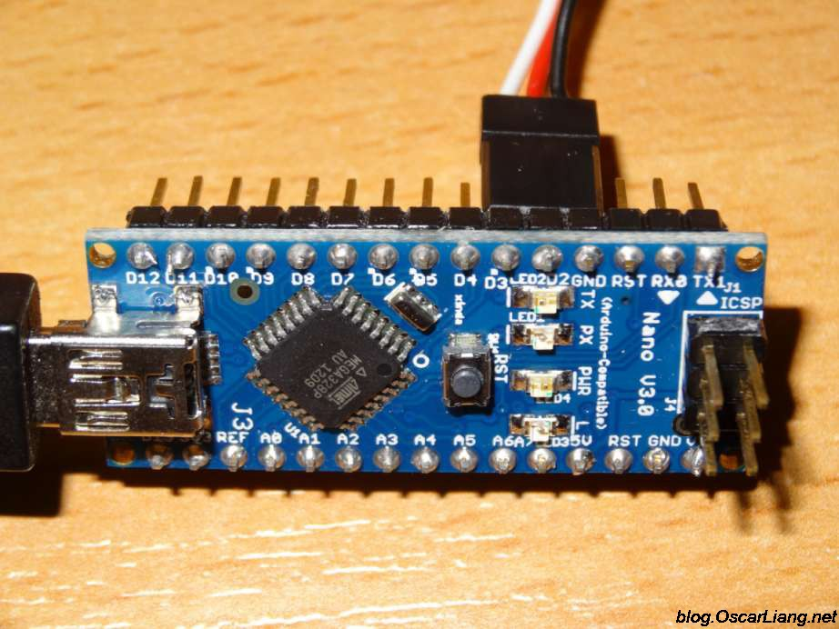
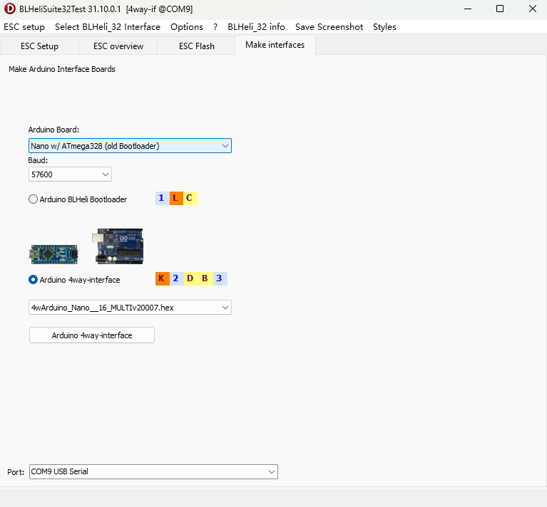
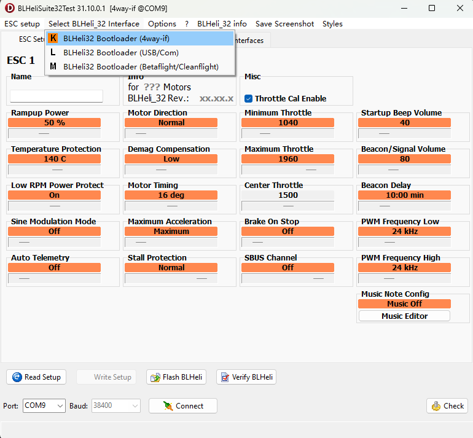
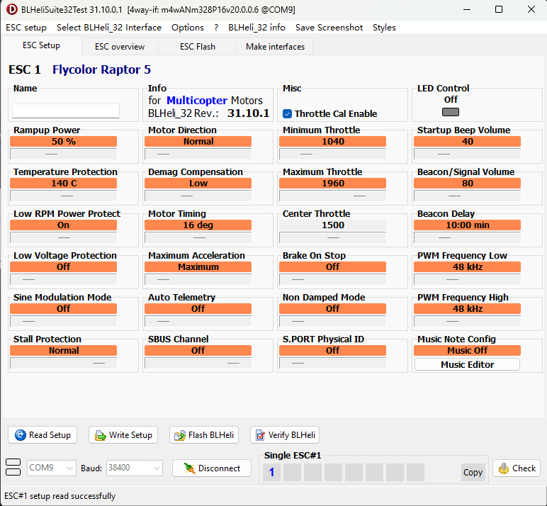
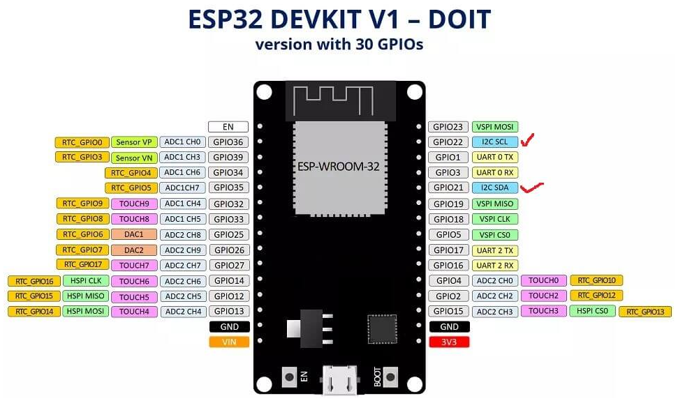
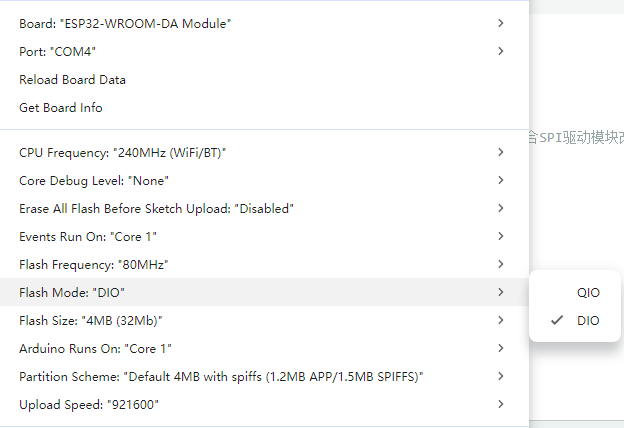

# ESP32-MotorTest

A Repository for BLDC Test and Data Collection with ESP32 Controller

## Flash BL-32 ESC Firmware (with Arduino Nano)

0. Prepare a Arduino Nano board to serve as the connection interface between PC and ESC:

  Pay attention to the port definitions.

1. Connect the Arduino board to the computer with the USB cable, then open the "BLHeliSuit32Test" program.

  You can find a copy of the program in this repository, under the "Tools" folder.

2. Program the Arduino to make the interface:

  Select "Nano w/ATmega328(old bootloader)", then make the 4way-interface. Make sure you have selected the right COM Port at the bottom of this page.

3. Connect the ESC with Arduino:

  As shown in the first figure, connect the signal input of the ESC to Arduino's "D3" port, and the "GND" to any of the "GND" port on the arduino.

  If your Arduino's port configuration is correct and ESC's input port is a 3-pin wire, you can directly plug the ESC to Arduino's "D3-D2-GND" ports without re-wiring.

4. Select the interface in the "BLHeliSuit32Test" program:

  Choose the interface as "4way-if", then click "Connect". Make sure you have selected the correct COM Port.

5. Read the settings and Adjust:

  Click "Read Setup" and wait for the configurations to be loaded. Then you can make adjustments and click "Write Setup" to refresh the ESC. The descriptions of these setups can be found at "BLHeli_32_Info->manual.pdf".

  **Important**: If you want to collect the voltage, current, temperature or rotation speed from the ESC, make sure to turn "Auto Telemetry" to "On"! (Then the ESC will send back the data once every 32ms) The data is sent through the "Tx" port of the ESC. (See the next subsection for more details)

  If multiple ESCs are used, all the "Tx"s can be connected together to one "Rx" port on the Autopilot or the Microcontroller.

## BLHeli32 ESC Telemetry Protocol Selection

  If you want the ESC to send its sensor data back to your receiver or your MCU, there are **2** ways to do that. Each method requires the **Auto Telemetry** to be switched on. 
  
  First, you connect the "Tx" port of the ESC to the S.Port of your receiver, you must **turn on the "S.Port Physical ID" in the ESC settings**. Then the data will be sent based on the S.Port protocol. 
  
  Second, you connect the "Tx" of ESC to your MCU only, expecting a regular data flow. Then you must **turn off the "S.Port Physical ID"** and read the data following the KISS protocol.

  - For S.Port protocol, please refer to [this link](https://deepwiki.com/marhar/FrSkySportTelemetry/2.2-frame-structure-and-protocol-constants). The S.Port protocol has a baudrate of **57600** and **inverted** signal. The data will only be sent when your receiver (the master device on the wire) send a pooling request first.

  - For KISS protocol, please refer to [this file](Tools/KISS_telemetry_protocol.pdf). The KISS data has a baudrate of **115200** and **normal** signal. The data are sent on a regular time basis even if no device is listening.

## ESP32 Settings

Overview of the ESP32-Wroom-DA module:

  The pins assignment here is not always necessary (or correct), because ESP32 allows the user to automatically assign most of its pins for different usage. But the number of Hardware I2C / UART / SPI is fixed.

- Devices Connection (Sensor)

  1. **ADS1115 ADC**: SCL-22, SDA-21, use port A0 to measure power module voltage reading, A1 to measure current reading (in unipolar mode), A2-A3 to measure force (in bipolar mode), A2+/A3-
  2. **ESC Telemetry**: Tx(of ESC)-26, set as the Serial1 Rx pin of MCU
  3. **X8R Receiver SBUS/UART**: Tx(of SBUS/UART board)-27, set as the Serial2 Rx pin of MCU
  4. **MT6701 Magnetic Encoder**: (Remember to enable the SPI output of the module first) CSN-5, CLK(SCK)-18, DO(MISO)-19
  - Warning: GPIO14 and GPIO25 are also occupied due to the usage of Serial1 and Serial2
  - Upload Project: ESP32_MotorTest_Sensors

- Devices Connection (Bridge)

  Just connetc to your PC via usb. (Maybe add an OLED display in the future)
  - Upload Project: ESP32_MotorTest_Sensors_Receiver

- Arduino Libraries Needed
  
  1. **Adafruit ADS1X15** bu adafruit;
  2. **U8g2** by oliver;
  - Remember to install all library dependencies.

- Arduino IDE Settings

  

## Force Sensor Settings

We use the **AD620** module to amplify the micro-voltage signal from the force sensor itself, then use **ADS1115** to read the voltage signal and transfer to the force readings.

Since the required amplification factor is $\approx440=3.3/7.5\times10^3$, we need to manually change the resistor on AD620 to **$100\Omega$**, which will result in an amplification factor of 495. The maximum voltage output (with 5V input for the force sensor) is 3.712V.