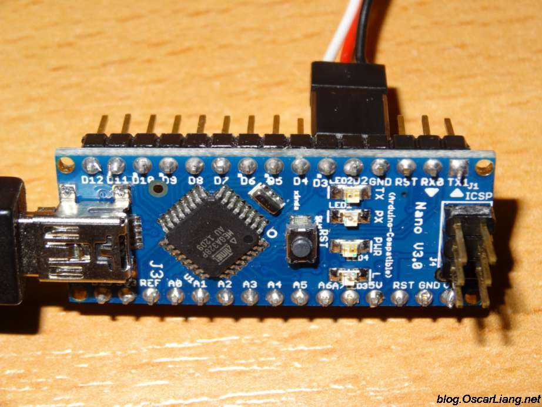
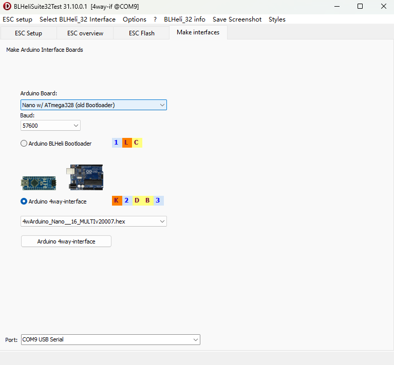
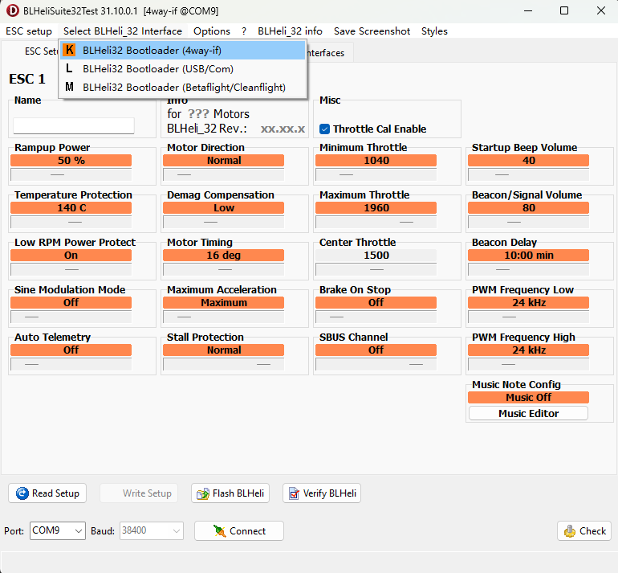
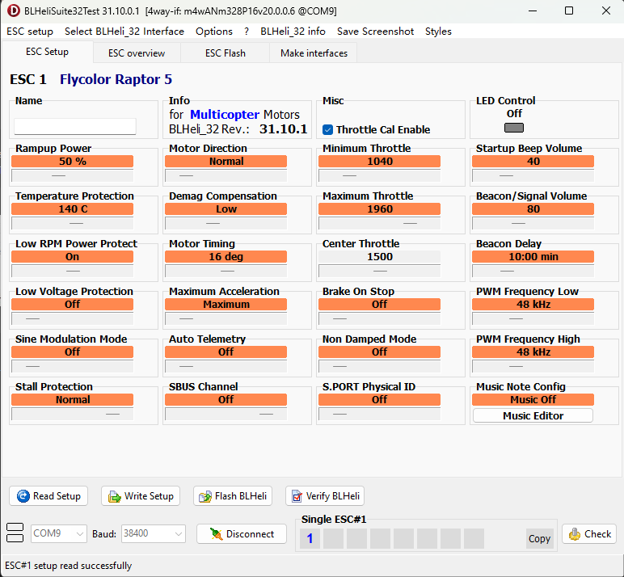
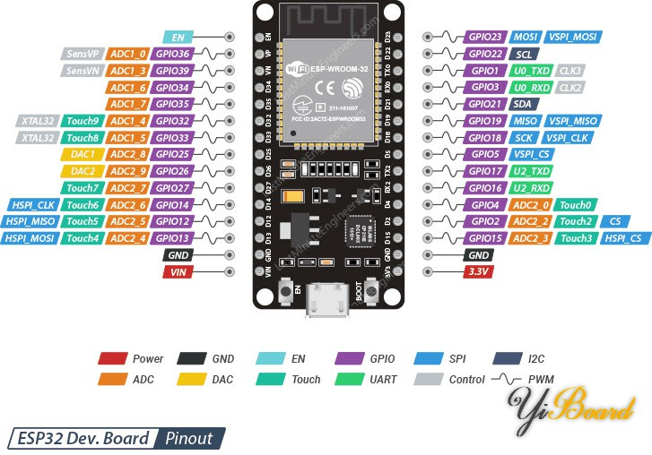
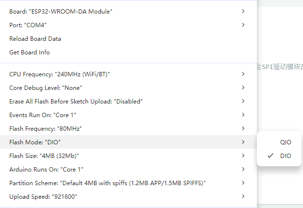

# ESP32-MotorTest

A Repository for BLDC Test and Data Collection with ESP32 Controller

## Flash BL-32 ESC Firmware (with Arduino Nano)

0. Prepare a Arduino Nano board to serve as the connection interface between PC and ESC:

    Pay attention to the port definitions.

1. Connect the Arduino board to the computer with the USB cable, then open the "BLHeliSuit32Test" program.

    You can find a copy of the program in this repository, under the "Tools" folder.

2. Program the Arduino to make the interface:

    Select "Nano w/ATmega328(old bootloader)", then make the 4way-interface. Make sure you have selected the right COM Port at the bottom of this page.

3. Connect the ESC with Arduino:

    As shown in the first figure, connect the signal input of the ESC to Arduino's "D3" port, and the "GND" to any of the "GND" port on the arduino.

    If your Arduino's port configuration is correct and ESC's input port is a 3-pin wire, you can directly plug the ESC to Arduino's "D3-D2-GND" ports without re-wiring.

4. Select the interface in the "BLHeliSuit32Test" program:

    Choose the interface as "4way-if", then click "Connect". Make sure you have selected the correct COM Port.

5. Read the settings and Adjust:

    Click "Read Setup" and wait for the configurations to be loaded. Then you can make adjustments and click "Write Setup" to refresh the ESC. The descriptions of these setups can be found at "BLHeli_32_Info->manual.pdf".

    **Important**: If you want to collect the voltage, current, temperature or rotation speed from the ESC, make sure to turn "Auto Telemetry" to "On"! (Then the ESC will send back the data once every 32ms) The data is sent through the "Tx" port of the ESC.

    If multiple ESCs are used, all the "Tx"s can be connected together to one "Rx" port on the Autopilot or the Microcontroller.

## ESP32 Settings

Overview of the ESP32-Wroom-DA module:

  The pins assignment here is not always necessary (or correct), because ESP32 allows the user to automatically assign most of its pins for different usage. But the number of Hardware I2C / UART / SPI is fixed.

- Devices Connection (Down)

  1. **SD Card Reader**: CS-5, SCK-18, MOSI-23, MISO-19
  2. **OLED Screen**: SCL-33, SDA-32
  3. **GY-85 IMU**: SCL-22, SDA-21
  4. **Serial 2**: Rx-4, Tx-25

- Devices Connection (Up)

  1. **SD Card Reader**: CS-5, SCK-18, MOSI-23, MISO-19
  2. **ADS1115 ADC**: SCL-22, SDA-21, use port A0 to measure power module voltage reading, A1 to measure current reading (in unipolar mode), A2-A3 to measure force (in bipolar mode), A2+/A3-
  3. **OLED Screen**: SCL-33, SDA-32
  4. **ESC Telemetry**: Tx(of ESC)-26, set as the Serial1 Rx pin of MCU
  5. **X8R Receiver SBUS/UART**: Tx(of SBUS/UART board)-27, set as the Serial2 Rx pin of MCU
  - Warning: GPIO14 and GPIO25 are also occupied due to the usage of Serial1 and Serial2

- Arduino Libraries Needed
  
  1. **SD** by Arduino;
  2. **Adafruit ADXL345** by Adafruit; **Adafruit HMC5883 Unified** by Adafruit; **Grove 3-Axis Digital Gyro** by Seeed Studio;
  3. **Adafruit ADS1X15** bu adafruit;
  4. **ArduinoJson** by Benoit Blanchon;
  5. **U8g2** by oliver;
  - Remember to install all library dependencies.

- Arduino IDE Settings

  

  